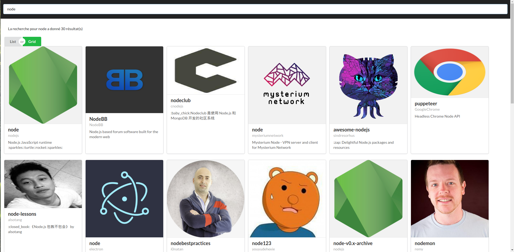

# Challenge Github API

Hey, et si on construisait un sytème de recherche pour des repos Github en full react en s'appuyant sur leur API ?

Yeah :tada:

## Objectif

Construire un moteur de recherche / annuaire de repos en s'appyuant sur l'API de Github.

Github fourni une API qui permet de chercher dans tous les repos, à cette adresse :

> https://api.github.com/search/repositories?q=MA_RECHERCHE

En remplaçant `MA_RECHERCHE` par ce qui a été saisi par l'utilisateur, vous obtiendrez une liste de resultats.

Doc : https://developer.github.com/v3/search/

## Instructions

Construire un système de rendu suite à une recherche

### Comment démarrer

1. Utiliser le modèle React
2. Installer semantic-ui-react : https://react.semantic-ui.com/ (rubrique usage)
3. Construire les composants React par exemple
   + `<App />`
   + `<SearchBar />` 
   + `<Results />`
4. Utiliser les composant semantic-ui par exemple
  + Pour `<SearchBar />` : `Form` et `Input`
  + Pour `<Results />` : `Card.Group` et `Card`
  + Ainsi que `Icon` et `Image`
5. Utiliser les ressources statiques `src/data/results.js`
6. Enfin, quand tout fonctionnera, accéder à l'API avec `axios` 

## Bonus : Mode d'affichage

Construire un système de rendu alternatif avec grille ou liste

### Comment
- `Button` de semantic-ui
- Changement de vue dans le state

## Bonus de la mort : Contenu d'un repo

Au clic sur un repo, afficher le contenu de ce repo

### Comment
- un composant `<Content />` avec le système de vue et l'appui de `Table` depuis semantic-ui
- Utiliser les données statique pour commencer `src/data/airbnb-contents.js`
- Brancher avec l'API `items.url` suivi de `/contents` pour obtenir la structure
